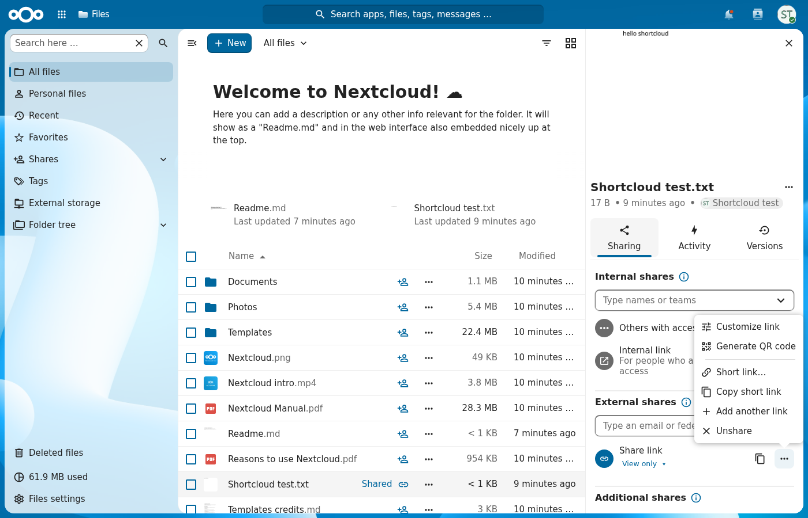
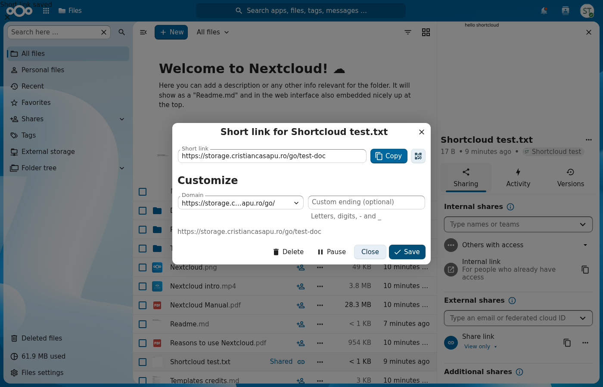
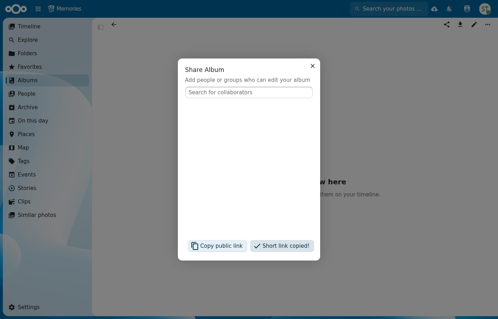
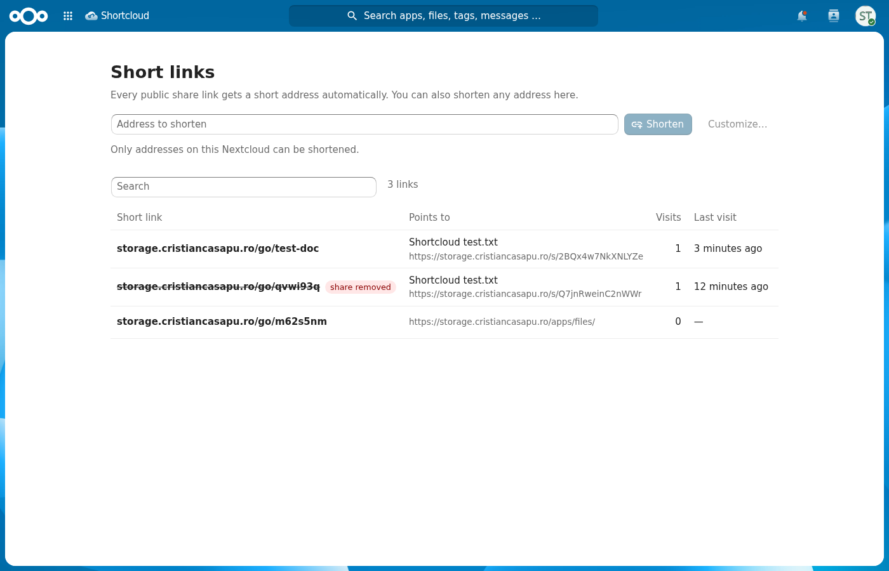
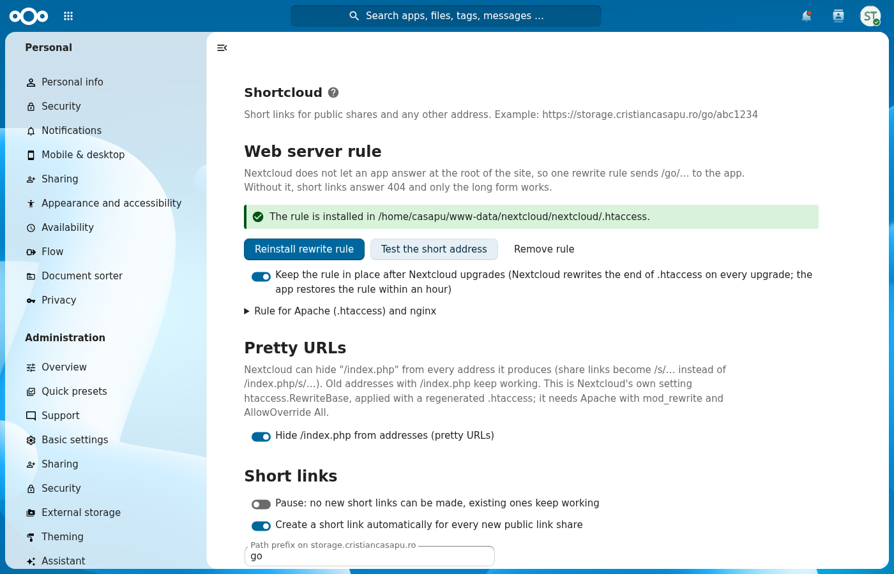

# Shortcloud — short links for your Nextcloud shares

Shortcloud turns every public share link into a short one, such as
`https://cloud.example.com/go/abc1234`, that redirects to the real share URL.
Short links are created automatically whenever a link share is made (from the
web, the desktop or the mobile clients), can be copied and customised right from
the sharing sidebar, and can be created by hand for any address from the
Shortcloud page.





Albums shared from Memories get a "Copy short link" button too (with the [casapu/nc34](https://github.com/CristianCasapu/memories/tree/casapu/nc34) branch of Memories):



## Features

- **Automatic**: every new public link share gets a short link, whatever client created it.
- **Albums too**: public album links of the Photos and Memories apps are picked up (one cheap change check every 15 minutes, or at once when the Shortcloud page opens).
- **In the sharing sidebar**: "Copy short link" and "Short link…" in the `…` menu of each link share, with a QR code.
- **Custom endings**: the domain is fixed, the rest is yours: `/go/annual-report`.
- **Custom short domains**: `https://cc.link/abc1234` served by the same server, no trusted-domain change needed.
- **Follows the share**: a renamed share token keeps working; a deleted or expired share answers *410 Gone* instead of redirecting.
- **Any address** can be shortened from the Shortcloud page, within the policy the administrator sets (only this Nextcloud by default, so the domain never becomes an open redirector).
- **Counts visits** and remembers the last one; never stores visitor addresses.
- **Pause** a link, or pause creation for everyone while old links keep working.
- **Disable the app** from the Apps page any time: every link stays stored and comes back unchanged when the app is enabled again.
- **Pretty URLs**: one switch hides `/index.php` from every Nextcloud address (Nextcloud's own `htaccess.RewriteBase` mode). Old addresses keep working.
- **Command line**: `occ shortcloud:setup`, `occ shortcloud:backfill`, `occ shortcloud:add`.
- **OCS API** for scripts: `/ocs/v2.php/apps/shortcloud/api/v1/links`.





## Requirements

- Nextcloud 32 – 34, PHP 8.1+.
- Apache with `mod_rewrite` and `AllowOverride All` for the one-click setup. Any other web server works with the snippet shown on the administration page.

## Setup

1. Install and enable the app. On Apache with a writable `.htaccess` that is all: the app writes its rule on the first request after enabling.
2. Otherwise open **Administration settings › Shortcloud**: it probes the short address over HTTP and tells you whether the rule works, offers **Install rewrite rule**, and shows the snippet for nginx or a virtual host. The block the app writes into Nextcloud's `.htaccess`:

   ```apache
   # BEGIN Shortcloud
   <IfModule mod_rewrite.c>
     RewriteEngine on
     RewriteRule ^go/(.*)$ apps/shortcloud/go.php?slug=$1 [END,QSA]
   </IfModule>
   # END Shortcloud
   ```

   The block sits just above Nextcloud's marker line, which `occ upgrade` and `occ maintenance:update:htaccess` leave untouched. A core update that replaces `.htaccess` drops it; the app puts it back exactly when that can happen: on every app update (which `occ upgrade` runs right after regenerating `.htaccess`), on the first request after a Nextcloud version change, and as a last resort once a day in the maintenance window. Administration › Overview warns when it is missing. You can also put the rule in the virtual host instead.
3. Optional: `occ shortcloud:backfill` gives the shares that existed before the app their short links.

Why a rewrite rule at all? Nextcloud keeps an allow-list of apps that may register routes at the root of the site, so a third-party app cannot answer at `/go/…` on its own. The rule sends the request to the app's entry point `go.php`, which boots Nextcloud like `public.php` does and runs the redirect controller through the normal middleware stack (brute-force protection, rate limiting, security headers).

### Custom short domain

1. Point the DNS of the domain (say `cc.link`) to the server and get it a certificate.
2. Add the domain under **Custom short domains** in the administration page.
3. Add the virtual host the page shows; in short:

   ```apache
   <VirtualHost *:443>
       ServerName cc.link
       DocumentRoot /var/www/nextcloud
       SSLEngine on
       SSLCertificateFile    /etc/letsencrypt/live/cc.link/fullchain.pem
       SSLCertificateKeyFile /etc/letsencrypt/live/cc.link/privkey.pem
       RewriteEngine on
       RewriteRule ^/(.*)$ /apps/shortcloud/go.php?slug=$1 [END,QSA]
   </VirtualHost>
   ```

   Only the redirector answers on that domain, so it does not have to be one of Nextcloud's trusted domains.

## Settings

| Setting | Meaning |
| --- | --- |
| Pause | No new short links; existing ones keep working. |
| Automatic short links | Create one for every new public link share. |
| Path prefix | `/go/` by default; changing it rewrites the rule. |
| Length of random endings | 7 by default (32-character alphabet without look-alikes). |
| Who may create | Everyone, or only members of chosen groups. Administrators always may. |
| Targets | Only this Nextcloud (default), a list of hosts, or any address. Share links are always allowed. |
| Reserved endings | Names never handed out. |
| Custom short domains | Extra hosts, with an optional prefix. |
| Pretty URLs | Nextcloud's `htaccess.RewriteBase` mode: hides `/index.php` from every address. |

## Command line

```
occ shortcloud:setup                    # install the rule (or --check, --remove)
occ shortcloud:setup --pretty-urls=on   # hide /index.php from addresses
occ shortcloud:backfill [--dry-run] [--user uid]
occ shortcloud:add https://… --user uid [--slug name] [--domain host] [--title label]
```

## API

All endpoints are OCS (`OCS-APIRequest: true`), under `/ocs/v2.php/apps/shortcloud/api/v1`:

| Method | Path | Purpose |
| --- | --- | --- |
| GET | `/config` | Domains and permissions of the current account |
| GET | `/links?search=&all=0` | Own links (`all=1` for administrators) |
| POST | `/links` | Create: `target` or `shareId`, optional `domain`, `slug`, `title` |
| PUT | `/links/{id}` | Change `slug`, `domain`, `target`, `title`, `status` (`active`/`paused`) |
| DELETE | `/links/{id}` | Delete |
| GET | `/share/{shareId}` | Short links of one of your link shares |
| POST | `/album/{token}` | Short link of one of your public album links (Photos / Memories), created if missing |

## Privacy

The app stores, per link: owner, domain, ending, target, the share it belongs to, a label (the file name), status, visit count and last visit time. No visitor data is stored.

## Development

```
npm ci && npm run build      # frontend (Vue 3, vite)
```

Copy the app to `apps/shortcloud` and run `occ app:enable shortcloud`.

## License

AGPL-3.0-or-later. © 2026 Cristian Casapu.
